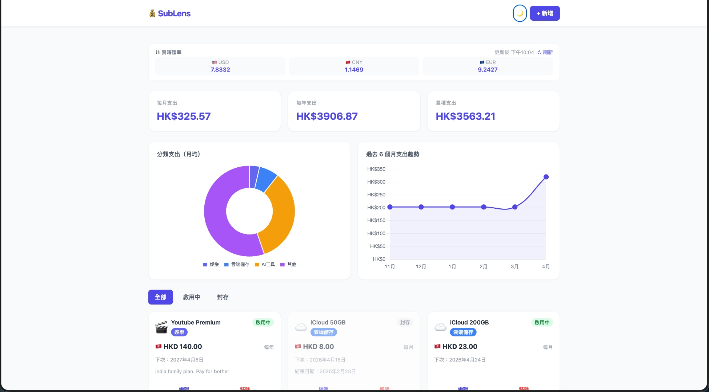
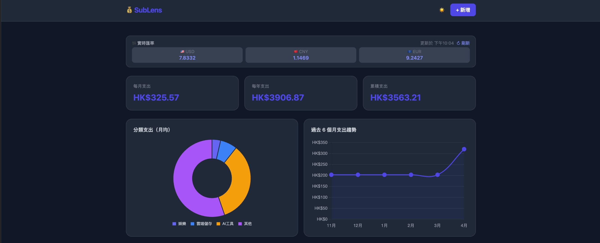

# 💰 SubLens

> 個人訂閱支出監察工具 — Track every subscription, stay in control.

SubLens 是一個純前端的互動網頁應用，幫助你追蹤所有軟件訂閱服務的支出，支援多貨幣換算、實時匯率、深色模式，資料儲存於 Google Sheets。

---

## ✨ 功能特色

- 📋 **訂閱管理** — 新增、編輯、移除訂閱，支援封存並保留帳單記錄
- 💸 **三種支出總覽** — 每月 / 每年 / 累積支出，自動換算至 HKD
- 🌍 **多貨幣支援** — HKD、USD、CNY、EUR，每張卡片顯示原幣及 HKD 換算值
- 📈 **實時匯率** — 透過 Google Sheets GOOGLEFINANCE 函數取得即時市場匯率
- 📊 **視覺化圖表** — 分類支出圓餅圖 + 過去 6 個月趨勢折線圖
- 🌙 **深色/淺色模式** — 一鍵切換，自動記住偏好設定
- 📱 **響應式設計** — 桌面及手機版完整支援
- ☁️ **雲端儲存** — 所有資料儲存於 Google Sheets，跨裝置同步

---

## 🖥️ 頁面預覽

| 淺色模式 | 深色模式 |
|---------|---------|
|  |  |

---

## 🛠️ 技術架構

| 項目 | 技術 |
|------|------|
| 前端 | HTML5 + Tailwind CSS (CDN) + Vanilla JavaScript |
| 圖表 | Chart.js (CDN) |
| 後端 API | Google Apps Script (Web App) |
| 資料庫 | Google Sheets |
| 匯率來源 | Google Sheets GOOGLEFINANCE 函數 |
| 部署 | GitHub Pages |

---

## 📁 檔案結構

```
sublens/
├── index.html          # 主網頁（完整前端應用）
├── appsscript.gs       # Google Apps Script 後端代碼
├── manifest.json       # PWA manifest
├── icons/              # 應用圖示
│   ├── favicon-16.png
│   ├── favicon-32.png
│   ├── icon-180.png
│   ├── icon-192.png
│   └── icon-512.png
└── README.md
```

---

## 🚀 快速開始

### 第一步：建立 Google Sheets

1. 前往 [sheets.new](https://sheets.new) 建立新試算表，命名為 **SubLens**
2. 建立三個分頁，設定欄位標題：

**`subscriptions` 分頁：**
```
id | name | category | emoji | billingCycle | amount | currency | startDate | endDate | nextBillingDate | status | notes
```

**`bills` 分頁：**
```
id | subscriptionId | date | amount | currency
```

**`rates` 分頁：**

| A | B |
|---|---|
| USDHKD | `=GOOGLEFINANCE("CURRENCY:USDHKD")` |
| CNYHKD | `=GOOGLEFINANCE("CURRENCY:CNYHKD")` |
| EURHKD | `=GOOGLEFINANCE("CURRENCY:EURHKD")` |

### 第二步：部署 Apps Script

1. 在 Google Sheet 點擊 **Extensions → Apps Script**
2. 刪除預設內容，貼入 `appsscript.gs` 的全部代碼
3. 按 **Ctrl+S** 儲存，將專案命名為 `SubLens API`
4. 點擊 **Deploy → New Deployment**
5. 選擇類型：**Web App**，設定如下：
   - Execute as：**Me**
   - Who has access：**Anyone**
6. 點擊 **Deploy**，複製生成的 **Web App URL**

### 第三步：設定前端

打開 `index.html`，找到頂部的 config 區塊，填入你的 Apps Script URL：

```js
const CONFIG = {
  API_URL: "https://script.google.com/macros/s/YOUR_ID/exec", // ← 填入你的 URL
  RATES: {
    USDHKD: 7.78,  // fallback 匯率
    CNYHKD: 1.07,
    EURHKD: 8.45
  }
};
```

### 第四步：部署到 GitHub Pages

1. 建立 GitHub repo，上傳所有檔案
2. 前往 **Settings → Pages**
3. Source 選擇 **Deploy from a branch → main → / (root)**
4. 等待約 1 分鐘，網站即上線

---

## 📊 Google Sheets 資料結構

### `subscriptions` 欄位說明

| 欄位 | 類型 | 說明 |
|------|------|------|
| `id` | string | UUID，自動生成 |
| `name` | string | 訂閱名稱（如 Netflix）|
| `category` | string | 娛樂 / 工作效率 / 雲端儲存 / AI工具 / 其他 |
| `emoji` | string | 顯示圖示（如 🎬）|
| `billingCycle` | string | `monthly` 或 `yearly` |
| `amount` | number | 金額 |
| `currency` | string | `HKD` / `USD` / `CNY` / `EUR` |
| `startDate` | string | 開始日期（YYYY-MM-DD）|
| `endDate` | string | 結束日期（封存時填入）|
| `nextBillingDate` | string | 下次扣費日期 |
| `status` | string | `active` 或 `archived` |
| `notes` | string | 備註（選填）|

---

## ⚠️ 注意事項

- 每次修改 `appsscript.gs` 後，必須重新 **Deploy → New Deployment** 才會生效
- Apps Script Web App URL 設為 Anyone 可存取，建議加入 token 驗證保護
- GOOGLEFINANCE 匯率約有 15 分鐘延遲，屬正常現象
- 所有資料儲存於你自己的 Google Sheet，不經過任何第三方伺服器

---

## 🔒 安全建議（可選）

在 `appsscript.gs` 頂部加入 token 驗證：

```js
function doGet(e) {
  const SECRET_TOKEN = "your-random-secret";
  if (e.parameter.token !== SECRET_TOKEN) {
    return ContentService.createTextOutput(
      JSON.stringify({ error: "Unauthorized" })
    ).setMimeType(ContentService.MimeType.JSON);
  }
  // ... 其餘代碼
}
```

前端 `CONFIG` 加入對應 token：

```js
const CONFIG = {
  API_URL: "...",
  TOKEN: "your-random-secret",
  RATES: { ... }
};
```

---

## 📅 開發記錄

| 版本 | 日期 | 更新內容 |
|------|------|---------|
| v1.0 | 2026-04-14 | 初始版本：訂閱管理、支出計算、圖表 |
| v1.1 | 2026-04-14 | 新增實時匯率、國旗顯示、深色模式 |
| v1.2 | 2026-04-14 | 修復日期顯示、趨勢圖計算、響應式佈局 |

---

## 📄 License

MIT License — 自由使用、修改及分發。
